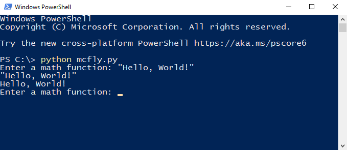

# McFly

## What is McFly?

McFly is a new programming language for mathematical operations that is being developed using Python. It is able to perform calculations based on the order of operations. Additionally, it can compare one number to another number using one of many comparison operations. McFly can also take in a quoted string of text and return that string without the quotes.

## The components of McFly:

### Math Operations 
  
- `+` for addition.
- `-` for subtraction.
- `*` for multiplication.
- `/` for division.
  

### Comparison Operations 
  
- `==` for comparing if 2 numbers have the same numerical value.
- `===` for comparing if 2 numbers are of the same type and have the same numerical value.
- `>` for comparing if 1 number is greater than another number.
- `<` for comparing if 1 number is less than another number.
- `>=` for comparing if 1 number is greater than another number or has the same numerical value.
- `<=` for comparing if 1 number is less than another number or has the same numerical value.
- `!=` for comparing if 2 numbers do not have the same numerical value.
- `!==` for comparing if 2 numbers do not have the same type and do not have the same numerical value.

### Boolean Operations
  
- `and` checks if both values are `True`. If so, then it will output `True`, else it will output `False`.
- `nand` is the opposite of `and`. `nand` is checks if 0 or 1 values is `True`. If so, then it will output `True`, else it will output `False`.
- `or` checks if at least 1 or 2 values is `True`. If so, then it will output `True`, else it will output `False`.
- `xor` checks if 1 of 2 values is `True`. If so then it will output `True` else it will output `False`.
- `nor` is the opposite of `or`. `nor` checks for if both values are `False` if so then it will output `True`, else it will output `False`.
- `not` inverts the output of the boolean values `True` or `False`.
  
  
### String Command
- `"` is used at the beginning and end of text to convert it to a string. 
>💡 The string output is printed without including the beginning and ending quotation marks. 

### Constants
  
- `#pi` is equal to `3.141592653589793`
- `#tau` is equal to `6.283185307179586`
- `#e` is equal to `2.718281828459045`

## Examples:
- Input: `3+3-3*3/3` Outputs: `3`
- Input: `#pi` Outputs: `3.141592653589793` 
- Input: `3+#pi*2` Outputs: `9.283185307179586`
- Input: `3.0==3` Outputs: `True`
- Input: `3.14==3.5` Outputs: `False`
- Input: `3.0===3` Outputs: `False`
- Input: `True or True` Outputs: `True`
- Input: `"Hello World!"` Outputs: `Hello World!`
  
## Optimizations:  

## How to run McFly on Windows:

1. [Install Python version 3 or higher.](https://www.python.org/downloads/) (If you already have version 3 or higher of Python installed you may omit this step.)
1. [Navigate to the raw mcfly.py file on GitHub.]("https://raw.githubusercontent.com/SeaFilmz/McFly/DevCode/mcfly.py")
1. Right click on the page and click `Save As...`
1. Save the file on your computer with the same file name and extension.
1. Use Windows Explorer to navigate to where the `mcfly.py` file is stored.
1. Click into the Explorer Address Bar to highlight the text.
1. Delete the text, type `powershell` in the Address Bar, press enter.
1. Powershell will open in the same directory you have navigated to.
1. While in Powershell, run the command `python mcfly.py`. 
1. McFly is running and ready to use if your terminal displays `Enter a math function:`

>💡 If you close powershell, you will need to repeat instructions 5-8 to rerun McFly.
 
